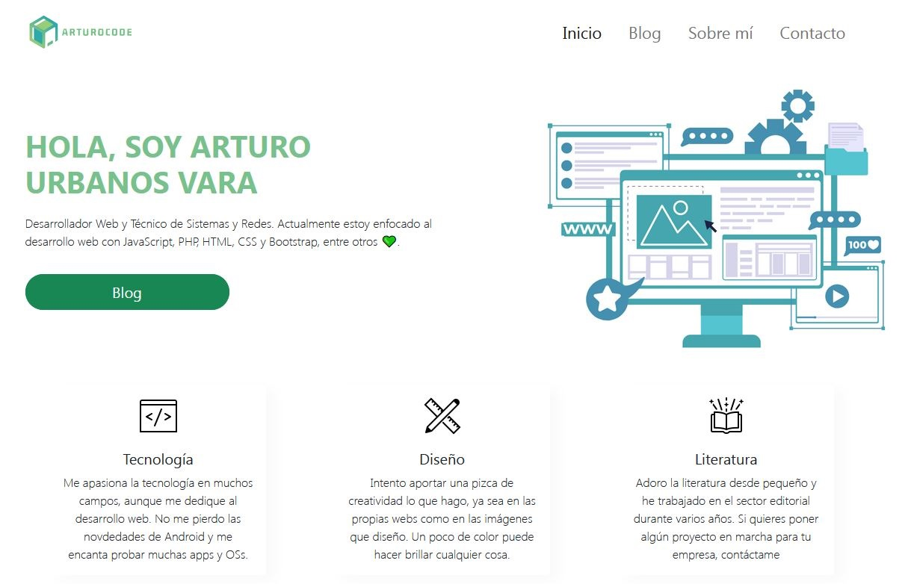
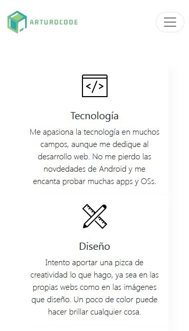

# Esta es mi página como desarrollador web

## Tiene estas secciones

#### Inicio 

- Sección con lo más importante sobre mi trabajo: las tecnologías que uso, lo que me gusta y avances sobre mi formación y experiencia.

- Incluye una sección visual de Proyectos con una brevísima descripción y una imagen con mis más páginas más reciente.

- También incluye enlaces con más información sobre mi experiencia y trabajo, al blog... Además de un footer con la navegación de la página y otros enlaces.

#### Blog

- Una página que muestra una entrada destacada al inicio y el total de entradas publicadas en dos columnas.

- Cada entrada tiene un diseño minimalista en el que solo se conserva el diseño de la barra de navegación de la página general.

- La tipografía está cambiada a una más enfocada a textos de artículos ya que las entradas estarán hechas siguiendo su típica estructura.

- Además, en PC se opta por un diseño centrado elegante y en movil uno que ocupa el espacio total de la pantalla, ya que no hay el mismo espacio en estos dispositivos.

#### Sobre mí

- Una página que sigue el mismo diseño que el banner de Inicio con una breve descripción sobre las tecnologías que uso, proyectos y educación.

- En dos columnas presento mi experiencia laboral y educación con descripción de ambas y tecnologías usadas.

- Finalmente hay una sección de Skills y Herramientas en la que clasifico las tecnologías que uso en Programación, Sistemas Operativos y Otros. De un vistazo se puede ver lo que manejo.

#### Contacto

- Una página simple con un formulario de contacto en el que cada respuesta está automatizada para que llegue a mi dirección de correo electrónico.

##### En la página hay distintas animaciones, un diseño responsive tanto en PC como en dispositivos móviles gracias a las Media Queries implementadas y más...

<table>
    <tr>
        <td></td>
        <td></td>
    </tr>
</table>